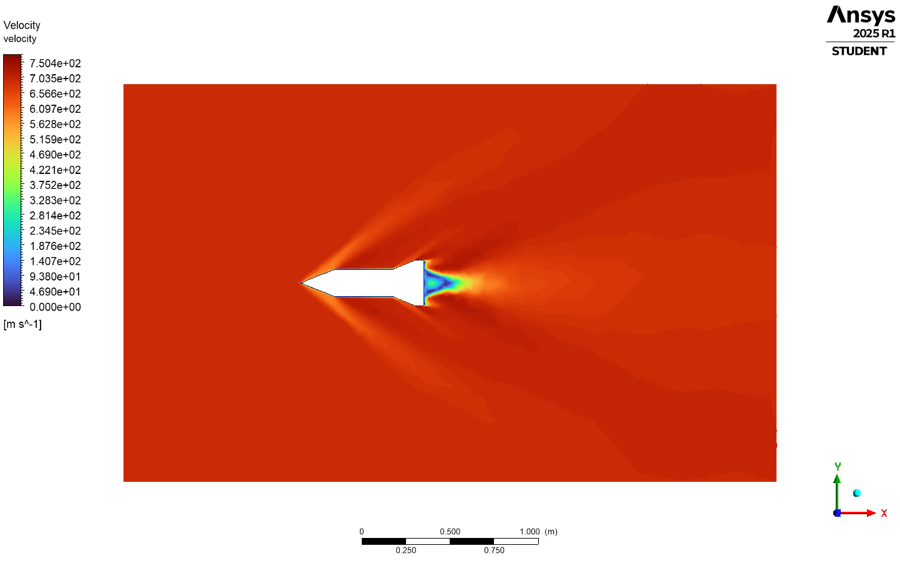
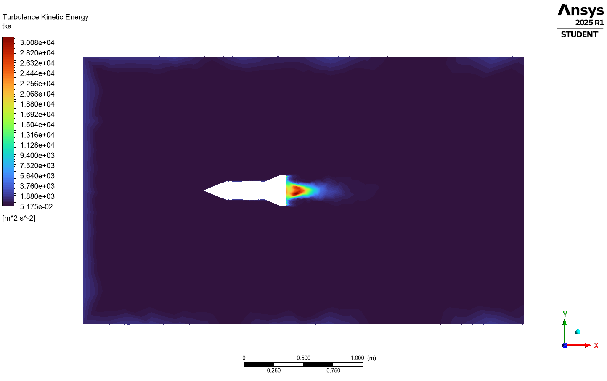
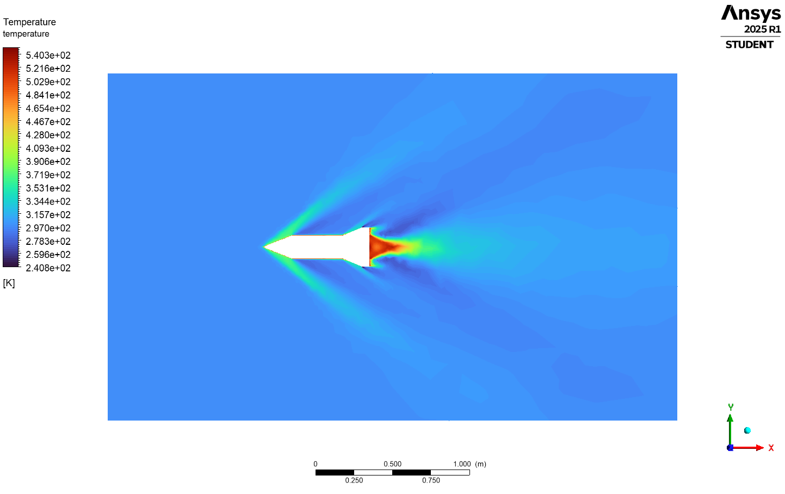

# 6-DOF Integrated Simulation and Control of a Guided Ramjet Projectile 


## Project Overview

This project establishes a **high-fidelity multi-physics simulation pipeline** designed to optimize the flight dynamics of a supersonic guided projectile.

Moving beyond simple point-mass ballistic estimation, this workflow integrates **Industrial CFD (Ansys Fluent)** for accurate aerodynamic characterization with a custom **Python-based 6-DOF Flight Engine**. The primary objective was to engineer a system capable of a **15 km precision intercept** from a low-altitude launch.

The analysis conclusively demonstrates that standard ballistic trajectories fail due to excessive supersonic wave drag ($C_d \approx 0.67$), validating the necessity of a **Ramjet propulsion system** integrated with **Proportional Navigation (PN)** control logic to achieve the mission profile.

Pictures

        

---

## 📂 Repository Structure

```text
6-DOF INTEGRATED SIMULATION AND CONTROL/
│
├── Ansys/                         # ANSYS Workbench & Fluent Project Files
│   ├── Ramjet_Projectile.wbpj
│   └── ...
│
├── Pictures/                      # Simulation Outputs & Visualization
│   ├── Mach2_Shockwave.png        # CFD: Mach contours showing shock capture
│   ├── Mach2_Density.png          # CFD: Expansion fans visualization
│   ├── Ramjet_Pressure.png        # CFD: Static Pressure distribution
│   ├── Ramjet_Temperature.png     # CFD: Static Temperature distribution
│   ├── Ramjet_Success.png         # Plot: Successful Ramjet Intercept
│   └── Ballistic_Failure.png      # Plot: Failed Ballistic Trajectory
│
├── aerodynamics.csv               # Curated Aerodynamic Database (Mach vs Cd/Cl)
├── main_simulation.py             # MAIN SCRIPT: Ramjet Physics & GNC Loop
├── higher_initial_velocity.py     # Trade Study: The "Big Gun" approach (Failed)
├── projectile_w_thrust.py         # Physics Class definition
└── Report.pdf                     # Full Technical Engineering Report
